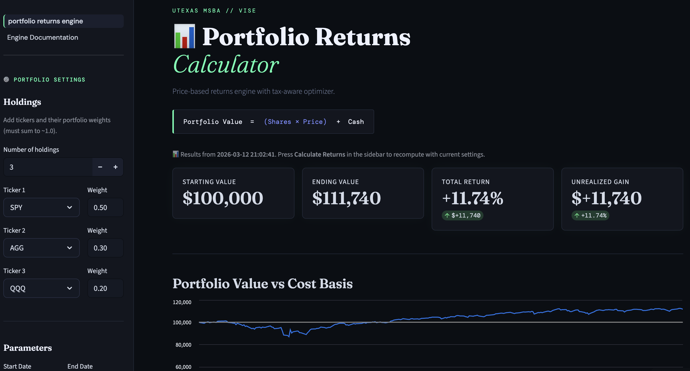

# Portfolio Returns Calculator

### Tax-Aware Portfolio Simulation & Optimization Engine



---

## Project Overview

The **Portfolio Returns Calculator** is a portfolio analytics and tax-loss harvesting simulation engine built with Streamlit. It allows users to test portfolio allocations, evaluate rebalancing strategies, and measure the impact of tax-aware optimization logic across historical price data.

Developed as part of the **UT Austin MSBA Vise Capstone**, this tool is designed to resemble an institutional-style analytics interface — purpose-built for simulation and backtesting rather than live trading execution.

Core capabilities:

- Historical price-based portfolio simulation with multi-asset support
- Tax-loss harvesting engine with short-term / long-term gain classification
- Flexible rebalancing strategies (buy-and-hold through threshold drift-band)
- Strategy comparison and performance analytics
- Interactive Streamlit dashboard with Bloomberg-terminal dark theme

---

## Live Application

To run locally:

```bash
streamlit run portfolio_returns_engine.py
```

The dashboard will open in your browser at `http://localhost:8501`.

---

## Key Features

| Feature | Description |
|---|---|
| Portfolio Simulation Engine | Historical return calculation across multi-asset portfolios |
| Tax-Loss Harvesting Logic | Detects unrealized losses, simulates sell-and-rebuy, tracks ST/LT gains |
| Flexible Rebalancing Strategies | Daily, Weekly, Monthly, Quarterly, and threshold drift-band |
| Backtesting Engine | Jupyter notebooks for strategy backtesting and comparison |
| Interactive Dashboard | Streamlit UI with sidebar controls and live chart updates |
| Portfolio Allocation Visualization | Portfolio value vs cost basis, drawdown, and drift charts |
| Strategy Comparison | Side-by-side metrics: CAGR, Sharpe, max drawdown, tracking error, IR |
| Excel Export | Download all result tables directly from the dashboard |
| Transaction Cost Modeling | Commission, slippage, and bid-ask spread inputs in sidebar |

---

## Project Architecture

```
portfolio-tlh-optimizer/
│
├── portfolio_returns_engine.py        # Main Streamlit app + simulation logic
├── optimizer_msba_v1_engine.py        # Tax-aware optimization engine (TLH + lot tracking)
├── ui_style.py                        # Bloomberg dark theme + CSS helpers
├── dividend_data.csv                  # Dividend reference dataset
├── requirements.txt                   # Python dependencies
├── LICENSE
├── README.md
│
├── pages/
│   └── 01_Engine_Documentation.py    # Tabbed engine documentation (all 5 topics)
│
├── Backtest/
│   ├── portfolio_backtest_vise.md             # Backtest analysis report
│   ├── vise_tlh_backtest_monthly_v2.ipynb     # TLH backtest notebook
│   ├── vise_rebalancing_recommendation.ipynb  # Rebalancing strategy notebook
│   └── portfolio_backtest_vise_files/         # Backtest chart images
│
└── .streamlit/
    └── config.toml                    # Dark theme config (primaryColor #4fffb0)
```

---

## Installation

**Clone the repository:**

```bash
git clone https://github.com/jringler30/portfolio-tlh-optimizer.git
cd portfolio-tlh-optimizer
```

**Create and activate a virtual environment:**

```bash
python -m venv venv
source venv/bin/activate        # Mac/Linux
venv\Scripts\activate           # Windows
```

**Install dependencies:**

```bash
pip install -r requirements.txt
```

---

## Running the Application

```bash
streamlit run portfolio_returns_engine.py
```

The app loads price data from Google Drive on first run (requires internet connection). Subsequent runs use the cached local parquet file.

---

## Example Use Cases

- Simulate a 3-asset portfolio (e.g. SPY / AGG / QQQ) across a custom date range
- Compare buy-and-hold vs. monthly rebalancing vs. threshold drift-band rebalancing
- Evaluate how tax-loss harvesting thresholds affect after-tax returns
- Visualize portfolio drawdown and value vs. cost basis over time
- Export strategy comparison tables to Excel for further analysis
- Run the backtest notebooks to evaluate TLH performance across market regimes

---

## Engine Documentation

The **Engine Documentation** page (accessible from the sidebar) covers five topics in a tabbed layout:

1. **Core Engine Overview** — simulation loop, V1–V4 engine progression
2. **Tax Engine ST vs LT** — short/long-term classification, carry-forward netting
3. **Sell Handling & TLH** — lot selection modes (FIFO / LIFO / TAX_OPTIMAL), TLH logic
4. **Dividends & Cashflows** — DRIP reinvestment, lot creation, cash handling
5. **Valuation & Performance** — daily NAV calculation, metrics, edge cases

---

## Version History

See all releases on the [GitHub Releases page](https://github.com/jringler30/portfolio-tlh-optimizer/releases).

| Version | Release | Summary |
|---|---|---|
| [v2.3](https://github.com/jringler30/portfolio-tlh-optimizer/releases/tag/v2.3) | Current | CI pipeline, tabbed engine docs |
| [v2.2](https://github.com/jringler30/portfolio-tlh-optimizer/releases/tag/v2.2) | — | Strategy recommendation notebook |
| [v2.1](https://github.com/jringler30/portfolio-tlh-optimizer/releases/tag/v2.1) | — | Excel exports, transaction costs, event log |
| [v2.0](https://github.com/jringler30/portfolio-tlh-optimizer/releases/tag/v2.0) | — | Backtest analysis added |
| [v1.2](https://github.com/jringler30/portfolio-tlh-optimizer/releases/tag/v1.2) | — | Engine enhancements |
| [v1.1](https://github.com/jringler30/portfolio-tlh-optimizer/releases/tag/v1.1) | — | Threshold rebalancing + UI fixes |
| [v1.0](https://github.com/jringler30/portfolio-tlh-optimizer/releases/tag/v1.0) | — | Initial release |

---

## Technology Stack

| Layer | Libraries |
|---|---|
| UI | Streamlit, custom CSS (Bloomberg dark theme) |
| Data | Pandas, NumPy, PyArrow, gdown |
| Analytics | SciPy, Plotly |
| Export | openpyxl |
| CI | GitHub Actions (Python 3.11, flake8) |

---

## Intended Use

This project is designed for:

- Portfolio strategy experimentation
- Tax-aware optimization simulation
- Financial analytics demonstrations
- Capstone research and academic deliverables

**Not intended for live trading execution.**

---

## Author

Joshua Ringler
MS Business Analytics — University of Texas at Austin

---

## License

[MIT License](LICENSE)
